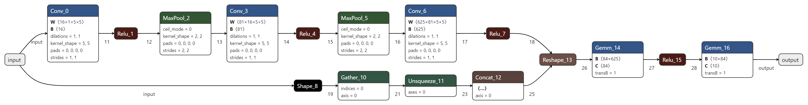
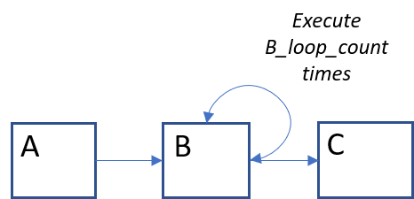
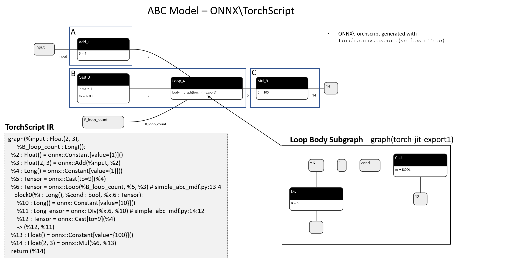

# ONNX MDF Converter

A python package for converting ONNX to MDF. This is a work in progress representing some ideas. ONNX IR maps fairly
well onto the MDF specification. Some elaborations of the original MDF spec have been implemented to make this
conversion easier. Parameters in MDF can contain MDF subgraphs. This is a key feature of ONNX that allows looping and
conditional constructs to execute as functions whose arguments are ONNX subgraphs that execute the body of the loop\if.
In addition, ONNX Constant Op nodes are converted to parameters on MDF nodes. 

## Installation

You can download and install the package with the following commands:

```
$ git clone https://github.com/ModECI/MDFTests.git
$ cd ONNX/onnx-mdf
$ python -m pip install -e .
```

## Examples

This is very experimental code. Only two examples have been tested currently. 

### Convnet



The ONNX file `examples/convnet.onnx` is a simple LeNet ConvNet model. Code for its training 
and ONNX generation is [here](https://github.com/ModECI/MDFTests/blob/onnx_mdf/ONNX/convnet_onnx_example/convnet_onnx_example.ipynb).

To run the converter on the above ONNX ConvNet model:

```
$ onnx-to-mdf examples/convnet.onnx
```

You can see the converted MDF models in [JSON](examples/convnet-mdf.json) and [YAML](examples/convnet-mdf.yml):

### ABC Sequential Model with Loop

This is an example of a PyTorch model that is implemented in `onnx_mdf/examples/simple_abc.py`. The model code
is very simple:

```python
import torch

class A(torch.nn.Module):
    def forward(self, x):
        return x + 1

@torch.jit.script
def loop_b(x, y):
    for i in range(int(y)):
        x = x / 10
    return x

class B(torch.nn.Module):
    def forward(self, x, y):
        return loop_b(x, y)

class C(torch.nn.Module):
    def forward(self, x):
        return x * 100

class ABC(torch.nn.Module):
    def __init__(self):
        super(ABC, self).__init__()
        self.A = A()
        self.B = B()
        self.C = C()

    def forward(self, x, B_loop_count):
        return self.C(self.B(self.A(x), B_loop_count))
```

This implements a PyTorch model with three modules. The modules process the input sequentially, and the
inner `B` module has a loop construct. 




It is exported to ONNX via a combination of tracing and scripting. The resulting ONNX model looks something
like this:



This ONNX IR representation can be converted to MDF. To run this full example, execute this command:

```
$ simple-abc-example
```

You can see the converted MDF models in [JSON](examples/abc-mdf.json) and [YAML](examples/abc-mdf.yml):


